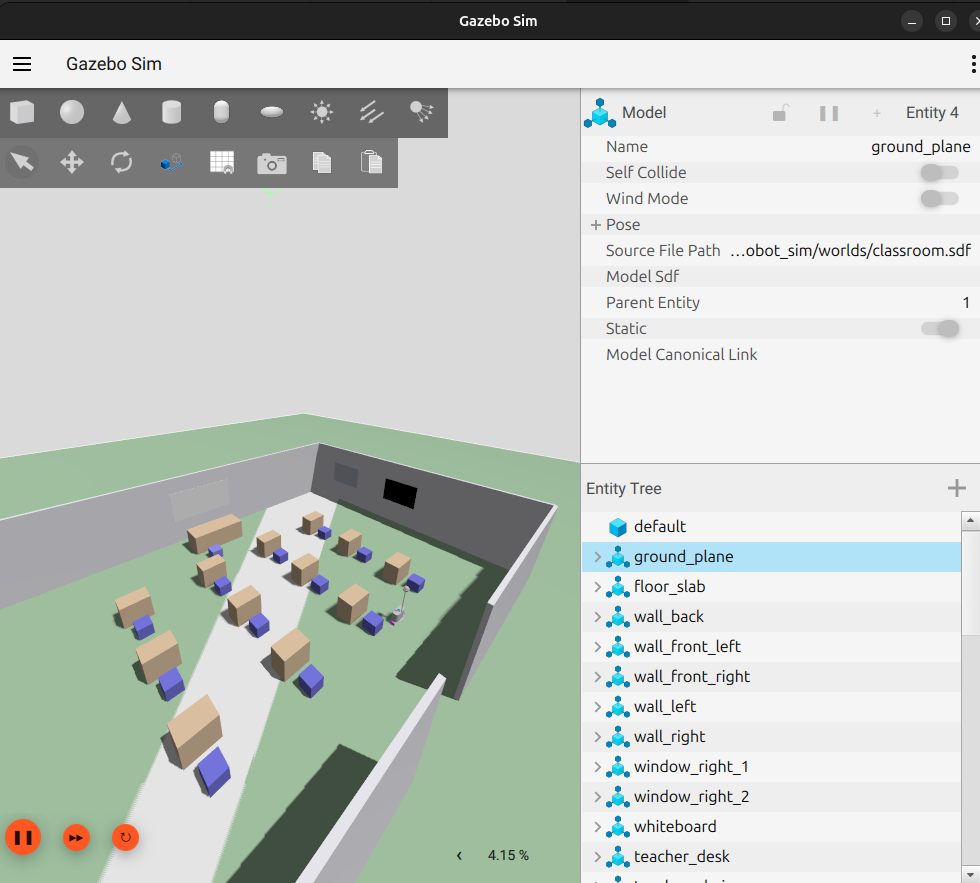

# Autonomous Exam Proctoring Robot

An intelligent mobile robot designed to autonomously navigate exam halls, monitor exam conditions, and ensure academic integrity. Built on ROS 2 with Gazebo Sim, this project combines SLAM-based navigation, waypoint following, and real-time monitoring capabilities to create a comprehensive exam proctoring solution.


*The AEP Robot in its natural habitat: navigating through a classroom environment*

## The Vision

Imagine an exam hall where a robot quietly patrols predefined routes, ensuring that every student has a fair testing environment. This project aims to build exactly that—a reliable, autonomous system that can navigate complex indoor spaces, follow waypoint sequences, and provide real-time monitoring without human intervention.

The robot isn't just moving around randomly; it's building a map of its environment using SLAM (Simultaneous Localization and Mapping), understanding where it is at all times, and following carefully planned patrol routes that cover the entire exam area efficiently.

## What We've Built So Far

### Robot Hardware Description

The robot is a differential drive platform equipped with:

- **LiDAR Sensor**: A 360-degree scanning LiDAR mounted on top for mapping and obstacle detection
- **Differential Drive System**: Two independently controlled wheels with caster supports for smooth navigation
- **IMU Integration Ready**: Inertial measurement unit link prepared for future sensor fusion
- **Modular Design**: Built from CAD models with precise inertial properties and collision geometries


*The robot's physical design, showing the LiDAR mount and differential drive configuration*

### Simulation Environment

We've created a realistic classroom environment in Gazebo Sim that mimics a typical exam hall:

- **14m × 10m Classroom**: Spacious enough for realistic navigation testing
- **Furniture Layout**: Desks, chairs, walls, and windows arranged to create navigation challenges
- **Physics-Based Simulation**: Accurate collision detection and sensor modeling


*The simulated classroom environment where the robot learns to navigate*

### Current Capabilities

Right now, the robot can:

1. **Spawn in Simulation**: The robot reliably appears in Gazebo with all sensors active
2. **Teleoperation**: Manual control via keyboard for testing and exploration
3. **Sensor Data Streaming**: LiDAR scans and odometry data flow correctly through ROS 2
4. **TF Tree Management**: Proper coordinate frame transformations for all robot components
5. **Basic Navigation Infrastructure**: Nav2 and SLAM packages are integrated and ready for configuration

## Our Approach

### Phase 1: Foundation (Current State)

We started by building a solid foundation:

**Robot Description (URDF/Xacro)**
- Created a parameterized robot macro that can be instantiated with different prefixes
- Defined accurate inertial properties from CAD models
- Set up proper TF tree with `base_footprint` as the root frame
- Integrated Gazebo plugins for differential drive control and LiDAR sensing

**Simulation Setup**
- Designed a classroom world that represents real exam hall conditions
- Configured Gazebo Sim 8 with proper physics and lighting
- Set up ROS-Gazebo bridges for seamless data flow between simulation and ROS 2

**Bringup System**
- Modular launch files for different scenarios (simulation, SLAM, navigation)
- Proper parameter management and configuration
- RViz visualization configurations for debugging and monitoring

### Phase 2: SLAM and Mapping (In Progress)

The next step is enabling the robot to build maps:

**SLAM Toolbox Integration**
- Configure `slam_toolbox` for real-time mapping
- Tune parameters for indoor LiDAR-based SLAM
- Generate and save maps of the classroom environment

**Localization**
- Set up `robot_localization` for sensor fusion
- Combine odometry, IMU, and LiDAR data for accurate pose estimation
- Ensure consistent localization during waypoint navigation

### Phase 3: Waypoint Navigation (Future Work)

This is where the robot becomes truly autonomous:

**Nav2 Configuration**
- Configure costmaps for obstacle avoidance
- Set up planners (A*, Theta*, etc.) for path planning
- Tune controllers for smooth waypoint following
- Implement recovery behaviors for stuck situations

**Waypoint Management**
- Create a waypoint definition system (YAML/JSON)
- Build a waypoint executor that sequences through patrol routes
- Implement pause/resume functionality for monitoring at specific locations
- Add waypoint validation to ensure routes are navigable

**Patrol Patterns**
- Define standard patrol routes (perimeter, grid, random)
- Implement dynamic route adjustment based on exam hall layout
- Create monitoring schedules that optimize coverage


*The planned navigation architecture: SLAM → Localization → Waypoint Following*

## Future Work: Building the Complete System

### High-Priority Features

**1. Complete SLAM Pipeline**
- [ ] Fine-tune SLAM Toolbox parameters for optimal map quality
- [ ] Implement map saving/loading for persistent navigation
- [ ] Add loop closure detection improvements
- [ ] Create map validation tools

**2. Robust Waypoint Navigation**
- [ ] Design waypoint file format and parser
- [ ] Implement waypoint following with Nav2
- [ ] Add waypoint arrival detection (proximity-based)
- [ ] Create patrol route editor/visualizer

**3. Exam Monitoring Integration**
- [ ] Design camera mounting and integration
- [ ] Implement computer vision for exam monitoring
- [ ] Create alert system for suspicious activities
- [ ] Build reporting dashboard for exam supervisors

**4. Real-World Deployment**
- [ ] Hardware integration (real LiDAR, motors, compute)
- [ ] Battery management and charging station integration
- [ ] Network connectivity for remote monitoring
- [ ] Safety systems (emergency stop, obstacle avoidance)

### Nice-to-Have Enhancements

- **Multi-Robot Coordination**: Multiple robots patrolling large exam halls
- **Adaptive Routes**: Routes that adjust based on student seating
- **Voice Announcements**: Pre-recorded instructions at waypoints
- **Mobile App**: Remote monitoring and control interface
- **Analytics Dashboard**: Track patrol coverage, time spent at locations


*The complete system architecture showing all components and data flows*

## Getting Started

### Prerequisites

- ROS 2 Jazzy (or compatible version)
- Gazebo Sim 8
- Ubuntu 22.04 or compatible Linux distribution
- Standard ROS 2 navigation stack packages

### Quick Start (Gazebo Only)

```bash
# From the workspace root
colcon build --symlink-install
source install/setup.bash

# Launch Gazebo with the AEP robot
ros2 launch robot_gazebo aep_gazebo.launch.py
```

Expected topics (key ones):
- `/cmd_vel`
- `/odom`
- `/scan`
- `/imu/data`
- `/joint_states`

### Installation

```bash
# Clone the repository
git clone https://github.com/KiranGunathilaka/autonomous_exam_proctoring_robot
cd exam_bot_ws

# Install dependencies
rosdep update
rosdep install --from-paths src --ignore-src -r -y

# Build the workspace
colcon build --symlink-install

# Source the workspace
source install/setup.bash
```

### Running the Simulation

**Basic Simulation with Teleoperation:**
```bash
ros2 launch robot_bringup sim_teleop_classroom.launch.py
```

This launches:
- Gazebo Sim with the classroom world
- Robot spawn with all sensors
- RViz for visualization
- Teleoperation keyboard control

**SLAM Mode (for mapping):**
```bash
ros2 launch robot_bringup slam_classroom.launch.py
```

### SLAM Mapping Workflow

1) Start SLAM:
```bash
ros2 launch robot_bringup slam_classroom.launch.py
```

2) Teleoperate in a second terminal:
```bash
ros2 run teleop_twist_keyboard teleop_twist_keyboard
```

3) Save the map when done:
```bash
ros2 run nav2_map_server map_saver_cli -f ~/aep_maps/classroom_map
```

**Full Navigation Stack:**
```bash
ros2 launch robot_bringup sim_classroom.launch.py
```

### Teleoperation (Keyboard)

In a second terminal (after sourcing the workspace):
```bash
ros2 run teleop_twist_keyboard teleop_twist_keyboard
```

Use the on-screen instructions to drive the robot (arrow keys or i/j/k/l).
If you want to send a one-shot command:
```bash
ros2 topic pub /cmd_vel geometry_msgs/msg/Twist "{linear: {x: 0.2}, angular: {z: 0.5}}" -1
```

### Teleoperation (Smoothed)

This adds a trapezoidal velocity profile so the robot doesn't jerk on start/stop:
```bash
ros2 launch robot_bringup teleop_smooth.launch.py
```

In another terminal, run the keyboard teleop and remap to the smoother input:
```bash
ros2 run teleop_twist_keyboard teleop_twist_keyboard --ros-args -r /cmd_vel:=/cmd_vel_raw
```

### Teleoperation (Toggle + Smoothed)

Press once to keep moving (no need to hold keys), with smooth accel/decel:
```bash
ros2 run robot_bringup teleop_toggle_smooth.py
```

### Quick Testing

Once the simulation is running:

1. **Teleoperate the robot**: Use the keyboard teleop to explore the environment
2. **View sensor data**: Check `/scan` (LiDAR) and `/odom` (odometry) topics
3. **Inspect TF tree**: `ros2 run tf2_ros tf2_echo base_footprint base_link`
4. **Visualize in RViz**: The robot model and sensor data should appear automatically

## Project Structure

The workspace is organized into focused packages:

- **`robot_description`**: URDF/Xacro files, meshes, and robot model definitions
- **`robot_sim`**: Gazebo world files and simulation launch configurations
- **`robot_bringup`**: Top-level launch files that orchestrate the entire system
- **`robot_slam`**: SLAM Toolbox configuration and mapping launch files
- **`robot_nav`**: Nav2 configuration files for navigation and path planning

Each package is designed to be modular and reusable, making it easy to swap components or adapt the system for different environments.

## Contributing

This is an active research and development project. Contributions are welcome! Areas where help is especially needed:

- SLAM parameter tuning and optimization
- Nav2 configuration improvements
- Waypoint navigation implementation
- Documentation and tutorials
- Testing and bug fixes

## License

Apache 2.0 License - See LICENSE files in individual packages for details.

## Acknowledgments

Built with:
- ROS 2 Navigation Stack (Nav2)
- SLAM Toolbox
- Gazebo Sim
- Robot Localization

---

**Current Status**: Foundation complete, SLAM integration in progress, waypoint navigation coming next.

For questions or collaboration opportunities, reach out to the maintainer at kimpdroids@gmail.com.
